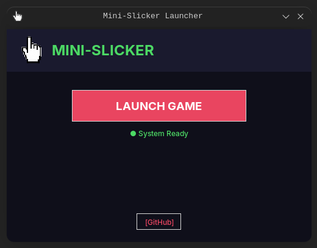
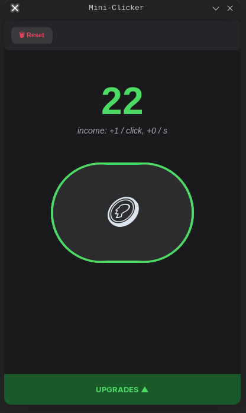

# 💰 mini-slicker

A stylish and lightweight Python clicker. Click the button, earn coins, and purchase upgrades! The game is designed with eye care in a modern "Dark Mode" design.

## 🚀 Features
* **Autosave**: All progress (coins, clicks, upgrades) is securely stored in `save.json`.
* **Progression system**: Purchase bonuses to increase your earnings with every click.
* **Launcher Pro**: Advanced launcher with a loading progress bar, news section, and quick links.
* **Visual Feedback**: Animated button and instant visual feedback.
* **Cross-platform**: Works perfectly on Windows and various Linux distributions.

---

## 📚 Projects in this repository

- **`mini-slicker`** – main clicker game and Launcher Pro.
- **(new project 1)** – short description.
- **(new project 2)** – short description.

> *Add your own projects here by editing the list.*

---

## 🧩 Dependencies and setup

The project uses `customtkinter` for its UI, so you need to install it once.

### 🐍 Python dependencies

1. Create a virtual environment in the project folder:

   ```bash
   python -m venv venv
   ```

2. Activate it:

   ```bash
   # Linux/macOS
   source venv/bin/activate

   # Windows (CMD)
   venv\Scripts\activate
   ```

3. Install required packages:

   ```bash
   python -m pip install customtkinter
   ```

   (Alternatively, after creating `requirements.txt`, run: `python -m pip install -r requirements.txt`.)

---

## 🛠 Installation and Run

### 🟦 For Windows Users (Step-by-Step)

1. **Installing Python**:
   * Download the installer from the [official python.org website](https://python.org).
   * **IMPORTANT:** When running the installer, be sure to check the **"Add Python to PATH"** box at the bottom of the window.
   * Select `Install Now`.
2. **Running the Game**:
   * Download this repository (**Code** -> **Download ZIP**) and unzip it.
   * Open the project folder in a terminal and run:
     ```bash
     python -m venv venv
     venv\Scripts\activate
     python -m pip install customtkinter
     python Launcher.py
     ```
   * *Tip: If the console window is getting in the way, rename `Launcher.py` → `Launcher.pyw`.*

### 🐧 For Linux users (various distributions)

On Linux, the `Tkinter` library is required. Install it with one command:

* **Ubuntu / Debian / Mint**:
  ```bash
  sudo apt update && sudo apt install python3-tk -y
  ```

* **Arch Linux / Manjaro**:
  ```bash
  sudo pacman -S tk --noconfirm
  ```

* **Fedora**:
  ```bash
  sudo dnf install python3-tkinter -y
  ```

Then install Python dependencies and run:

```bash
cd /path/to/mini-slicker

# Create virtual environment
python3 -m venv venv
source venv/bin/activate

# Install dependencies (customtkinter)
python3 -m pip install customtkinter

# Launch the game
python3 Launcher.py
```

💡 To avoid typing this every time, you can reuse the same virtual environment:

```bash
source venv/bin/activate
python3 Launcher.py
```

---

## 📂 Project Structure
* `main.py` — The game core (interface, logic, and visual effects).
* `Launcher.py` — Professional launcher with a progress bar and UI feedback.
* `icons/` — Game assets and UI elements.
* `save.json` — User progress file (created automatically).

## 🎨 Screenshots
<p align="center">
  
  
</p>

## 🏗 Future Updates
- [ ] **Auth System**: Player profiles and nicknames.
- [ ] **Auto‑clickers**: Passive income system.
- [ ] **Particles**: Pop‑up "+1" text animations.
- [ ] **Sounds**: Juicy click and shop effects.

---

## 📜 License
Distributed under the MIT License. Feel free to use and modify!

Developed with ❤️ in Python.

---

## 🤝 Contributing

Contributions are welcome! If you want to improve `mini-slicker`, here’s how:

1. **Fork the repository** on GitHub.
2. **Clone your fork**:
   ```bash
   git clone https://github.com/your-username/mini-slicker.git
   cd mini-slicker
   ```
3. **Create a new branch**:
   ```bash
   git checkout -b feature/your-feature-name
   ```
4. **Make changes** (code, UI, docs, etc.).
5. **Test** that `Launcher.py` and `main.py` still work:
   ```bash
   python3 Launcher.py
   ```
6. **Commit** and push:
   ```bash
   git add .
   git commit -m "Add: your short description"
   git push origin feature/your-feature-name
   ```
7. Go to GitHub and **open a Pull Request (PR)** against the `main` branch.

### What we accept:
- Bug fixes and performance improvements.
- UX / UI tweaks that keep the dark‑mode aesthetic.
- New progression features (upgrades, auto‑clickers, etc.).
- Translations or docs improvements (like this README).

We may ask you to rebase or update your PR before merging. Thank you for helping to grow `mini-slicker`! 🎮
