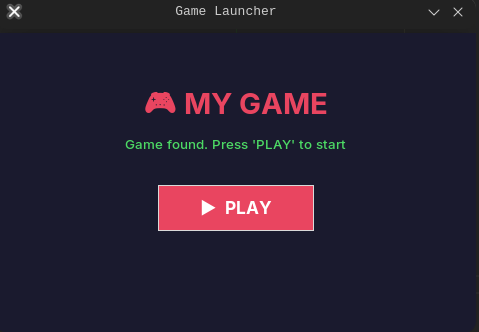
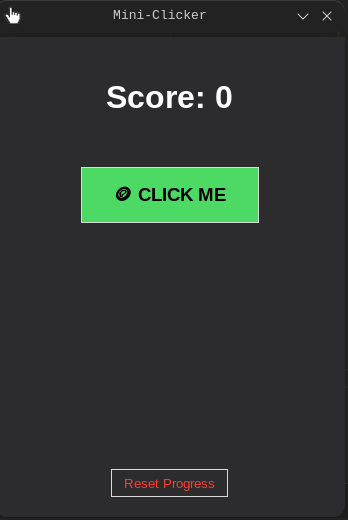

# 💰 mini-slicker

A stylish and lightweight Python clicker. Click the button, earn coins, and purchase upgrades! The game is designed with eye care in a modern "Dark Mode" design.

## 🚀 Features
* **Autosave**: All progress (coins, clicks, upgrades) is securely stored in `save.json`.
* **Progression system**: Purchase bonuses to increase your earnings with every click.
* **Launcher Pro**: Advanced launcher with a loading progress bar, news section, and quick links.
* **Visual Feedback**: Animated button and instant visual feedback.
* **Cross-platform**: Works perfectly on Windows and various Linux distributions.

---

## 🛠 Installation and Run

### 🟦 For Windows Users (Step-by-Step)

1. **Installing Python**:
* Download the installer from the [official python.org website](https://python.org).
* **IMPORTANT:** When running the installer, be sure to check the **"Add Python to PATH"** box at the bottom of the window.
* Select `Install Now`.
2. **Running the Game**:
* Download this repository (**Code** -> **Download ZIP**) and unzip it.
* Simply double-click the `Launcher.py` file to start.
* *Tip: If the console window is getting in the way, rename files to `.pyw` extension.*

### 🐧 For Linux users (various distributions)

On Linux, the `Tkinter` library is required. Install it with one command:

* **Ubuntu / Debian / Mint**:
```bash
sudo apt update && sudo apt install python3-tk -y
```
* **Arch Linux / Manjaro**:
```bash
sudo pacman -S tk --noconfirm
```
* **Fedora**:
```bash
sudo dnf install python3-tkinter -y
```

**Launch**: Navigate to the folder and enter:
```bash
python3 Launcher.py
```

---

## 📂 Project Structure
* `main.py` — The game core (interface, logic, and visual effects).
* `Launcher.py` — Professional launcher with progress bar and news feed.
* `icons/` — Game assets and UI elements.
* `save.json` — User progress file (created automatically).

## 🎨 Screenshots
<p align="center">
  
  
</p>

## 🏗 Future Updates
- [ ] **Auth System**: Player profiles and nicknames.
- [ ] **Auto-clickers**: Passive income system.
- [ ] **Particles**: Pop-up "+1" text animations.
- [ ] **Sounds**: Juicy click and shop effects.

---

## 📜 License
Distributed under the MIT License. Feel free to use and modify!

Developed with ❤️ in Python.
